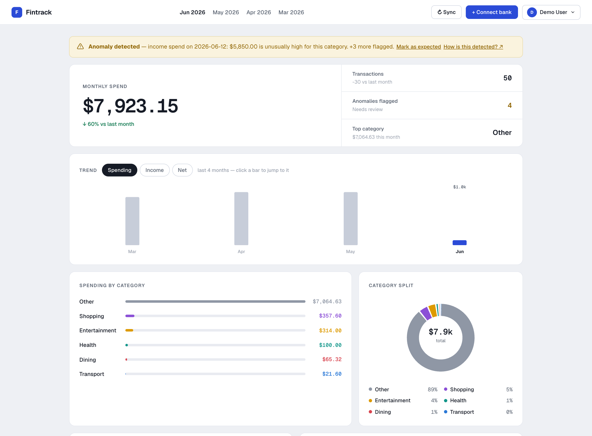

# Fintrack

A full-stack personal finance app: link real bank accounts, see where your money goes, and let ML flag what looks wrong — behind production-grade auth.

[](https://github.com/MatthewMo520/budgeting-and-finance-app/actions/workflows/ci.yml)




## Live demo

Try it without creating an account or linking a real bank:

- **App:** https://frontend-production-fcda.up.railway.app
- **Demo login:** `demo@fintrack.app` / `FintrackDemo123` (no 2FA)
- Click **Connect bank**, pick any bank (mock Chase works well), and sign in with Plaid's sandbox credentials **`user_good`** / **`pass_good`** to load sample data.

> Use Chrome — Safari blocks the cross-site session cookie. The demo account is routed to Plaid **sandbox**; real accounts use **production**.

## Features

**Track**
- Per-account **balances** and a **net worth** chart built from daily snapshots
- **Multiple linked banks** per user; transactions stay current via Plaid's cursor-based **/transactions/sync** + signed webhooks (handles corrections and removals, not just new rows)
- Merchant **names and logos** from Plaid enrichment; every transaction is **tagged with its bank account**, with a per-bank filter on the list
- **Honest spend accounting** — credit-card payments and inter-account transfers never count as spending, so a purchase and the payment that covers it are never double-counted

**Understand**
- Per-user **anomaly detection** (Isolation Forest) with plain-English explanations — and a **"mark as expected"** action the model remembers, so re-runs never re-flag it
- Layered **auto-categorization** with one-click manual overrides the model learns from
- A rule-based **insights feed**: category spending spikes, newly detected subscriptions, possible duplicate charges
- **Recurring charge / subscription detection** with estimated monthly cost

**Plan**
- **Budgets** per category with progress bars and **email alerts** at 90% / 100%
- **Cash-flow forecast** — "on track for ~$2,400 this month" from your run-rate plus upcoming recurring charges
- **Savings goals** funded by your real net cash flow
- A **month-end email recap**: total spend, top categories, anomalies, insights — both it and budget alerts have **opt-out toggles** in Settings

**Experience**
- 12-month **trend chart** (spending / income / net — click a bar to jump to that month), category **drill-down**, and a **daily-spend calendar heatmap**
- Transaction **search**, one-click **CSV export**, keyboard shortcuts (`←`/`→` months, `/` to search)
- **Dark mode** (light / dark / system), mobile-friendly layout, installable as a **PWA**

## ML layer

- **Anomaly detection (unsupervised):** `IsolationForest`, fit **per user** on a 3-feature matrix — absolute amount, amount relative to its category's average, and day-of-month — so "unusual" is relative to that person's own patterns (a big-but-normal Rent charge isn't flagged; an oversized Dining charge is). Plaid doesn't provide this.
- **Categorization (layered):** a precedence chain — the user's own corrections → high-precision **keyword rules** (payroll → Income, card payment → Payments) → **Plaid's `personal_finance_category`** → a **TF-IDF (char n-grams) + Random Forest** classifier as the fallback. Char n-grams generalize to dirty/unseen names (`McDonald's` matches a `McDonalds` training example). Trained once, cached in memory.
- **Forecasting:** end-of-month projection = spend so far + trailing-90-day daily rate + monthly recurring charges that haven't hit yet (recurring merchants are excluded from the daily rate to avoid counting them twice).

## Security

- Access token lives in JS memory only; refresh token in an `httpOnly` cookie — no JWTs in `localStorage`, so XSS can't steal a session
- Per-user `token_version` revocation: changing or resetting a password invalidates every outstanding token
- Mandatory 2FA — authenticator app (TOTP) or emailed codes (SHA-256-hashed, 10-minute expiry, 5-attempt cap); the TOTP secret can't be re-generated while 2FA is on, and disabling 2FA or deleting the account requires the password again
- Plaid access tokens and TOTP secrets encrypted at rest (Fernet); verification/reset tokens stored as SHA-256 hashes; verification links expire after 24h
- Deleting an account revokes the linked Plaid items — bank connections don't stay live
- Redis-backed rate limiting (proxy-aware), security headers incl. HSTS, explicit CORS allow-list, timing-safe login, zxcvbn password strength enforced server-side with a live meter in the UI

## How it's built

```
React SPA (Vite + Tailwind) ──► FastAPI ──► PostgreSQL 15
                                  │
                                  ├─ routers/        transactions · budgets · goals · insights · plaid · networth
                                  ├─ ml.py           categorizer, anomaly detection, insights, forecast (pure functions)
                                  ├─ digest.py       month-end recap emails (APScheduler + digest_log dedupe)
                                  └─ plaid_client.py Link, cursor-based sync, balances, webhooks
```

Deployed on Railway (backend + frontend + Postgres + Redis). Startup runs idempotent migrations, so deploys need no manual SQL.

## Running locally

You'll need Docker and Node 20+.

```bash
# Postgres + backend
docker compose up --build

# Frontend (separate terminal)
cd frontend && npm install && npm run dev
```

- Frontend: http://localhost:5173
- Backend: http://localhost:8000
- API docs: http://localhost:8000/docs

Emails (verification, 2FA codes, digests) print to the backend console when `SENDGRID_API_KEY` is unset, so every flow is testable without an email provider.

## Tests

Unit tests (pure logic: categorization, recurring detection, insights, forecast, digest, auth helpers) plus a full **API integration suite** — register → verify → login → 2FA, transaction scoping, spend accounting, CSV escaping, and the mocked Plaid sync engine — running against a throwaway Postgres database:

```bash
docker compose up db -d                             # integration tests need Postgres
cd backend && JWT_SECRET_KEY=test pytest -q tests/  # integration auto-skips if the DB is down
```

CI runs everything against a `postgres:15` service container, plus a frontend build, on every push/PR.

## Environment variables

Create a `.env` file in the root:

```
PLAID_CLIENT_ID=
PLAID_SECRET=                # secret for PLAID_ENV (per-environment)
PLAID_ENV=sandbox            # sandbox | production
PLAID_SANDBOX_SECRET=        # only in prod, so the demo account can use sandbox
PLAID_WEBHOOK_URL=           # https://<backend>/plaid/webhook — enables transaction auto-sync
PLAID_TOKEN_ENC_KEY=         # Fernet key: python -c "from cryptography.fernet import Fernet; print(Fernet.generate_key().decode())"
DATABASE_URL=postgresql://financeuser:financepass@db:5432/financedb
JWT_SECRET_KEY=              # openssl rand -hex 32 (required — app won't start without it)
SENDGRID_API_KEY=            # optional locally — emails print to stdout without it
FROM_EMAIL=
FRONTEND_URL=http://localhost:5173
ALLOWED_ORIGINS=http://localhost:3000,http://localhost:5173
COOKIE_SECURE=false          # true in prod (https)
COOKIE_SAMESITE=lax          # none in prod if frontend & backend are on different domains
REDIS_URL=                   # rate-limit store (optional locally; set in prod)
DEMO_EMAIL=                  # optional — shared demo account (auto-provisioned on startup)
DEMO_PASSWORD=
```
